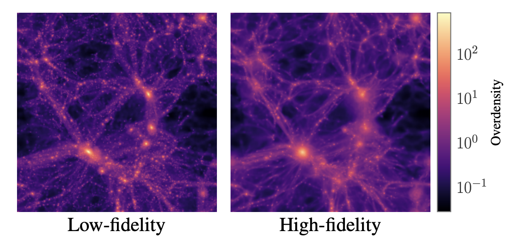

## Multilevel neural simulation-based inference

<a href="https://arxiv.org/abs/2506.06087" target="_blank">Paper (NeurIPS 2025)</a>

<center>

</center>


We suggest a method to combine multifidelity simulation in neural SBI. 
In many scientific domain, it is common to have simulators with different fidelity
levels; low fidelity simulator simplifies reality a lot, or use coarse mesh size, 
while high fidelity simulator is more aligned with real world. Ideally, we would
use many high-fidelity samples to do SBI; however it is often computationally 
prohibitive. In this paper, we suggest a method to combine these multifidelity 
simulator using the framework of multilevel Monte Carle (MLMC). We show that using
MLMC to approximate the training objective of neural SBI lead cost efficient SBI.

::: {.callout-note collapse="true"}
## Cite

```bibtex
@article{hikida2025,
  title={Multilevel neural simulation-based inference},
  author={Hikida, Yuga and Bharti, Ayush and Jeffrey, Niall and Briol, Fran{\c{c}}ois-Xavier},
  journal={Advances in Neural Information Processing Systems (NeurIPS)},
  year={2025},
  url={https://arxiv.org/abs/2506.06087}
  }
```
:::


## Amortised and provably-robust simulation-based inference


<a href="https://arxiv.org/abs/2602.11325" target="_blank">arXiv Preprint</a>

We leverage the framework of generalised Bayesian inference (GenBayes) to achieve 
posterior estimation that is robust to outliers. Specifically, we propose 
Neural Score Matching Bayes, a method that uses the score matching divergence as 
the loss function within the GenBayes framework. In this approach, the parameters 
of an unnormalised likelihood are modelled by a neural network, enabling application 
in simulator-based settings.

::: {.callout-note collapse="true"}
## Cite

```bibtex
@article{bharti2026amortised,
  title         = {Amortised and Provably-Robust Simulation-Based Inference},
  author        = {Bharti, Ayush and Dellaporta, Charita and Hikida, Yuga and Briol, Fran{\c{c}}ois-Xavier},
  year          = {2026},
  eprint        = {2602.11325},
  archivePrefix = {arXiv},
  primaryClass  = {stat.ML},
  doi           = {10.48550/arXiv.2602.11325}
}
```
:::


::: {.callout-note collapse="true" appearance="simple" icon=false}

<details>
<summary><strong>Past projects</strong></summary>


## Lossless Visualization of 4D Compositional Data on a 2D Canvas

<!--  -->

<!-- <a href="https://arxiv.org/abs/2210.07278" target="_blank">arXiv Preprint</a> | <a href="https://github.com/marvinschmitt/MetaUncertaintyPaper" target="_blank">Code</a><br> -->
<a href="https://arxiv.org/abs/2403.11141" target="_blank">arXiv Preprint</a>

The paper suggests the method to visualize 4D compositional data on a 2D canvas.
This can be used to visualize data such as posterior model probabilities for 4 
models on (2D) paper without loss of information and distortion. My contributions 
are general polishing of manuscript, creating 3D interactive figures and 
animation, and development of R package (planned).

----

## R package "metabmc"

The package implements meta-uncertainty quantification for Bayesian model 
comparison. This can be used to evaluate trustworthiness of posterior model 
probabilities, which tend to take extreme values. Check 
[the project website](https://meta-uncertainty.github.io) for more detail.
The development is still in progress and will be published in near future.

----

## R package for Bayesian proxy structural VAR

The package implements Bayesian vector autoregressive model with proxy variables 
for structural shocks in economy. This can help agents like government and central
bank to make decisions, considering the expected effects in the system of economy. 
The development is still in progress and will be published in near future.


